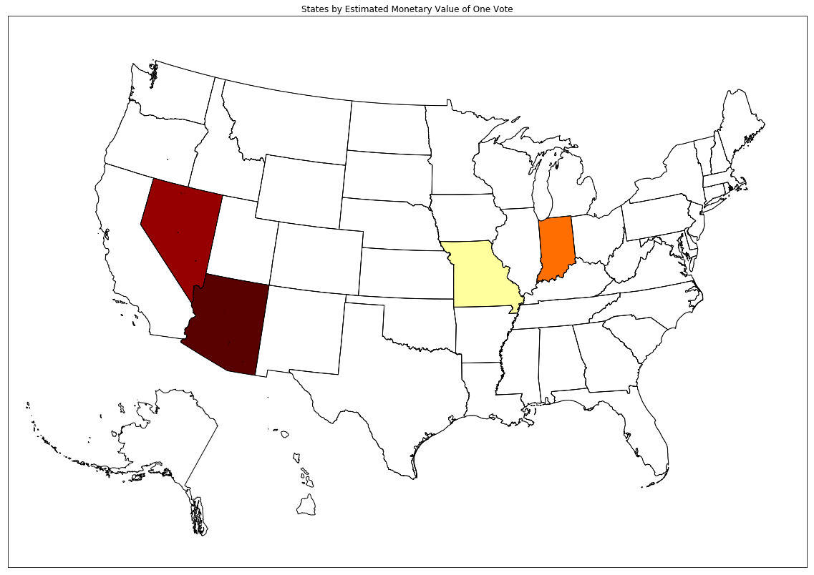
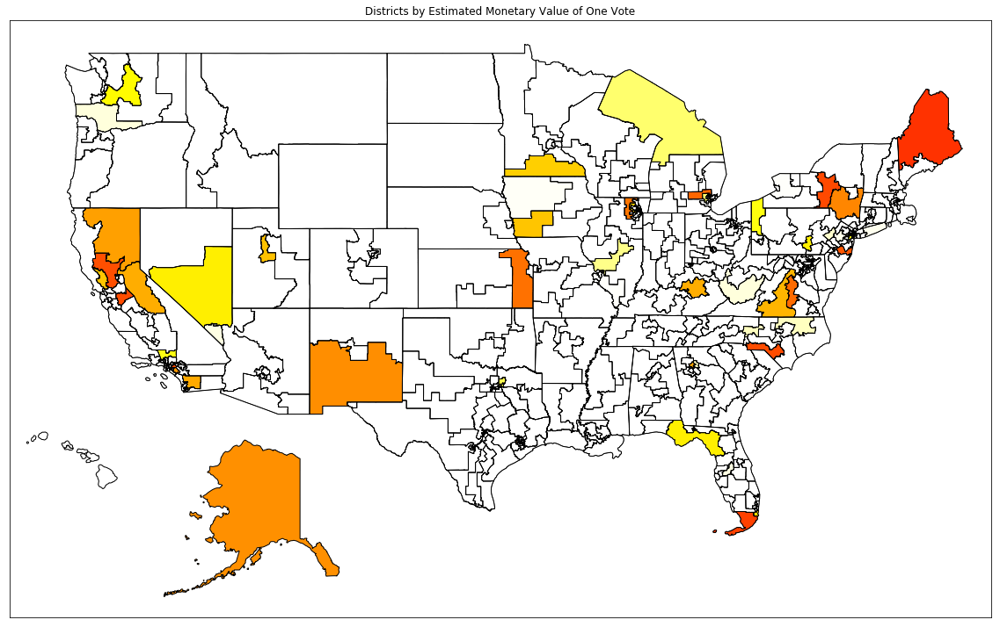

# voter_power
## Author: Eric Bolton
## Date: 01/02/2019

Many reasons exist to exercise one's right to vote. Beyond simply fulfilling one's civic duty, voting constitutes a way to make one's voice heard, to feel part of something bigger, and to participate in the great democratic experiment. In addition to that, and purely practically speaking, one might want to vote simply because increased turnout [affects policy outcomes](http://www.nyu.edu/gsas/dept/politics/seminars/hajnal_s06.pdf).

Yet, every election cycle in America, tens of millions of eligible voters stay at home. It's easy to see why: in elections where hundreds of thousands vote - sometimes millions - the perception may be that one's voice is likely to be lost in the cacophony of the crowd, providing little motivation to head to the polls. One might argue that one's vote only truly "counts" if their vote is the one to push their candidate of choice over the brink, an event that many see as far too unlikely to warrant a visit to the voting booth.

But this perception may be misguided. Consider this: if each vote has only a one in ten million chance of changing outcome of an election, but that election affects billions of dollars at a national scale, then each vote is effectively "worth" hundreds of dollars. In this light, voting is a rational decision per se, if only as an act of charity. This is the argument made by renowned statistician [Andrew Gelman](https://80000hours.org/2016/11/why-the-hour-you-spend-voting-is-the-most-socially-impactful-of-all/).

So, using this reasoning, how much is one's vote truly worth? This project seeks to answer that in the context of the 2018 Midterm Elections for the House and Senate.

# Simulating Elections

In order to come up with an answer, we first need to discover the likelihood that one's vote would have changed the outcome of individual races. Leading up to Election Day, this perceived likelihood depended on two key factors: what the polls were saying about each race (closer races, and more uncertain races have higher odds of being decided by one vote) and what kind of turnout is expected (races with fewer voters have higher odds of being decided by one vote). To this end, I designed a `Country` object that would read and organize the relevant data\* into `State` objects, which in turn were associated with `Race` objects.

\*Available in this repository


```python
import elections

# Create national election predictor
country = elections.Country('../data')
```

First I looked at the polls for each race leading up to Election Day. I only considered polls that were taken during October or November\*. Here I assumed that races with no such polls available were essentially uncontested - an assumption that held true in a vast majority of cases, but that definitely weakens the analysis. Follow up work should seek to use voting history for counties as a predictor for races where polling data was lacking.

My next assumption was that the number of polling respondents favoring a given candidate would follow a Binomial distribution.  I approximated this distribution as a Normal distribution based on the polling responses.

Now, using the expected turnout, we can find the probability that a voter would have a decisive vote. Here, I cheated a little and used the actual turnout on Election Day; future work should use projected turnout based on early vote counts and voting history.

\*Polls were obtained from [Real Clear Politics](https://www.realclearpolitics.com/elections/2018/)


```python
district_probabilities = {}
for state in country.states:
    for district in state.districts.values():
        p = district.tipping_point_probability()
        district_probabilities[district.code] = p
```

Typically, only one Senate seat is contested per state. But the exits of Al Franken (D-MN) and Thad Cochran (R-MS) from the Senate required special elections in Minnesota and Mississippi. For simplicity's sake, I'm picking the larger of the two probabilities in these cases.

(*Note that the seats are examined in alphabetical order of their codes - i.e. 'MS' will be seen before 'MS2'*)


```python
senate_seat_probabilities = {}
for state in country.states:
    for seat in state.senate_seats.values():
        p = seat.tipping_point_probability()
        if not seat.code.endswith('2'):
            senate_seat_probabilities[state.name] = p
        else:
            senate_seat_probabilities[state.name] = max(p, senate_seat_probabilities[state.name])
```

# Simulating Chamber Votes

Now that we know the likelihood of one's vote changing the outcome for each individual race, we want to compute the likelihood of each individual race dramatically changing the outcome of key House and Senate votes. To predict the outcome of votes, I used partisanship scores available on [VoteView](https://voteview.com), which tracks the partisanship of each senator and representative based on their voting history. For candidates whose partisanship scores weren't available, I simply used the average score of elected officials from their party in their state.

I created a `ChamberVote` object that looks at how Senators or Representatives actually voted on a past issue\* in order to predict, using logistic regression, how a new class of elected officials would vote. In this example, I use the Senate vote to repeal Obamacare, which narrowly failed on July 28, 2017.

\*This data is also available via [VoteView](https://voteview.com).


```python
from votes import ChamberVote

vote = ChamberVote('../data/votes/obamacare_senate.csv', 
                   country.official_scorer)
```

Now, all that remains to be done is to simulate different elections and use that to estimate how often the Obamacare vote would come down to just one vote in either chamber. In the past, polling has been known to exhibit a national bias toward one party or the other of up to 2\%, so I am including an election bias for each election cycle.


```python
import numpy as np
import progressbar

sims = 10000
senate_power = 0
house_power = 0
p = progressbar.ProgressBar(term_width = 80)

for n in p(range(sims)):
    
    election_bias = np.random.normal(0, 0.02)
    
    # Include Mike Pence's tie-breaking vote
    mike_pence_score = np.matrix([0.655, 0.088])
    senate_scores = country.simulate_senate(election_bias)
    senate_scores = np.concatenate((senate_scores, mike_pence_score))
    senate_diff = vote.get_result(senate_scores)
    
    house_scores = country.simulate_house(election_bias)
    house_diff = vote.get_result(house_scores)
    
    if abs(senate_diff) == 1:
        senate_power += 1
    if abs(house_diff == 1):
        house_power += 1

house_power /= sims
senate_power /= sims
```

    100% |#########################################################################|


Finally, we can combine the probability that a voter would be decisive in their race, and the probability that their candidate of choice would be decisive in their chamber, by multiplying them (assuming they represent independent events).

We can then multiply this result by the cost of Obamacare (\$133 billion) estimated by the Congressional Budget Office. This will tell us how much each vote was worth in the 2018 election when it came to the issue of healthcare.


```python
from collections import defaultdict
from heapq import nlargest
from operator import itemgetter
import pandas as pd

# Obamacare cost estimate
cost = 1.33e9 

senate_seats = defaultdict(lambda: [])
senate_seat_values = {}
for senate_seat, p in senate_seat_probabilities.items():
    senate_seats['state'].append(senate_seat)
    senate_seats['decisive_voter_probability'].append(p)
    
    value = p * cost * senate_power
    senate_seat_values[senate_seat] = value
    value_string = f'${round(value, 2):.2f}'
    senate_seats['value_of_vote'].append(value_string)

districts = defaultdict(lambda: [])
district_values = {}
for district, p in district_probabilities.items():
    districts['district'].append(district)
    districts['decisive_voter_probability'].append(p)
    
    value = p * cost * house_power
    district_values[district] = value
    value_string = f'${round(value, 2):.2f}'
    districts['value_of_vote'].append(value_string)
    
senate_seats_df = pd.DataFrame.from_dict(senate_seats)
districts_df = pd.DataFrame.from_dict(districts)

display(districts_df.nlargest(10, 'decisive_voter_probability'))
display(senate_seats_df.nlargest(10, 'decisive_voter_probability'))
```


<div>
<table border="1" class="dataframe">
  <thead>
    <tr style="text-align: right;">
      <th></th>
      <th>district</th>
      <th>decisive_voter_probability</th>
      <th>value_of_vote</th>
    </tr>
  </thead>
  <tbody>
    <tr>
      <th>180</th>
      <td>ME2</td>
      <td>0.000122</td>
      <td>$3142.25</td>
    </tr>
    <tr>
      <th>97</th>
      <td>FL26</td>
      <td>0.000113</td>
      <td>$2902.19</td>
    </tr>
    <tr>
      <th>266</th>
      <td>NY22</td>
      <td>0.000108</td>
      <td>$2769.87</td>
    </tr>
    <tr>
      <th>53</th>
      <td>CA39</td>
      <td>0.000107</td>
      <td>$2750.06</td>
    </tr>
    <tr>
      <th>50</th>
      <td>CA10</td>
      <td>0.000107</td>
      <td>$2738.35</td>
    </tr>
    <tr>
      <th>293</th>
      <td>NC9</td>
      <td>0.000106</td>
      <td>$2713.30</td>
    </tr>
    <tr>
      <th>45</th>
      <td>CA3</td>
      <td>0.000105</td>
      <td>$2692.03</td>
    </tr>
    <tr>
      <th>248</th>
      <td>NJ3</td>
      <td>0.000099</td>
      <td>$2553.57</td>
    </tr>
    <tr>
      <th>205</th>
      <td>MI8</td>
      <td>0.000091</td>
      <td>$2332.45</td>
    </tr>
    <tr>
      <th>405</th>
      <td>VA7</td>
      <td>0.000087</td>
      <td>$2242.28</td>
    </tr>
  </tbody>
</table>
</div>


<div>
<table border="1" class="dataframe">
  <thead>
    <tr style="text-align: right;">
      <th></th>
      <th>state</th>
      <th>decisive_voter_probability</th>
      <th>value_of_vote</th>
    </tr>
  </thead>
  <tbody>
    <tr>
      <th>2</th>
      <td>Arizona</td>
      <td>2.956321e-05</td>
      <td>$7769.45</td>
    </tr>
    <tr>
      <th>27</th>
      <td>Nevada</td>
      <td>2.387209e-05</td>
      <td>$6273.78</td>
    </tr>
    <tr>
      <th>13</th>
      <td>Indiana</td>
      <td>8.375660e-06</td>
      <td>$2201.19</td>
    </tr>
    <tr>
      <th>24</th>
      <td>Missouri</td>
      <td>3.792585e-07</td>
      <td>$99.67</td>
    </tr>
    <tr>
      <th>25</th>
      <td>Montana</td>
      <td>4.958546e-18</td>
      <td>$0.00</td>
    </tr>
    <tr>
      <th>47</th>
      <td>West Virginia</td>
      <td>4.273533e-18</td>
      <td>$0.00</td>
    </tr>
    <tr>
      <th>8</th>
      <td>Florida</td>
      <td>2.734816e-18</td>
      <td>$0.00</td>
    </tr>
    <tr>
      <th>23</th>
      <td>Mississippi</td>
      <td>1.568430e-20</td>
      <td>$0.00</td>
    </tr>
    <tr>
      <th>37</th>
      <td>Pennsylvania</td>
      <td>1.535593e-22</td>
      <td>$0.00</td>
    </tr>
    <tr>
      <th>41</th>
      <td>Tennessee</td>
      <td>4.930823e-24</td>
      <td>$0.00</td>
    </tr>
  </tbody>
</table>
</div>


Let's see how these results look on a map:


```python
from plot_us_map import plot_districts, plot_states

plot_states(senate_seat_values, 0, 10000)
plot_districts(district_values, 0, 10000)

```








```python

```
